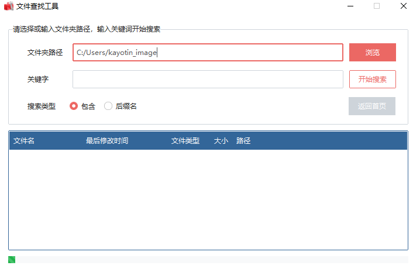

# kayotin_image_files
图片转换格式，转ICO，转jpg。以及一些文件分类操作。

### 需要的库：

pathlib，pillow，ttkbootstrap 

### How to use

运行kayotin_main.py即可，主界面如下：

子界面如下：

### 包含以下功能

1. jpg转png
2. png转ico
3. 查询文件：支持模糊查询，返回查询到的路径
4. 整理文件：根据文件类型整理至不同文件夹
5. 查找重复文件：将重复的文件移动到一个文件夹，可以确认后进行删除

### 更新

1. 目前已经全部更新成了图形界面，使用ttk，更加便于操作

