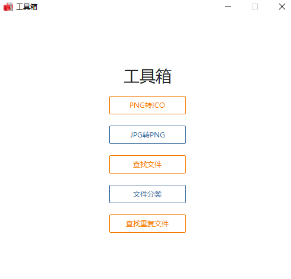

# kayotin的工具箱

## kayotin_image_files
图片转换格式，转ICO，转jpg。以及一些文件分类操作。另外把自己的一些常用代码也放在这个库了。

### 需要的库：

pathlib，pillow，ttkbootstrap 

### How to use

运行kayotin_main.py即可，
也可以直接下载release版本运行。
主界面如下：

<kbd></kbd>

子界面如下：

<kbd></kbd>

### 包含以下功能

1. jpg转png
2. png转ico
3. 查询文件：支持模糊查询，返回查询到的路径
4. 整理文件：根据文件类型整理至不同文件夹
5. 查找重复文件：将重复的文件移动到一个文件夹，可以确认后进行删除

### 更新

1. 目前已经全部使用ttk更新成了图形界面，便于操作

## NLP
使用阿里云的NLP进行分词，和进行一些简单的购物车关联词语分析。

## 滑块验证码
使用滑块验证码，跳过JD的登录验证。

## 问卷星填写
https://github.com/zzmvp-1/wjx-auto-fill

批量录入答案，用以得到想要的结果。

